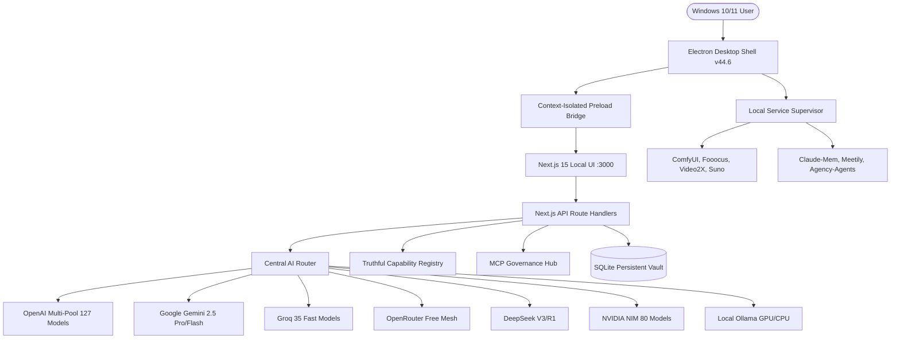

# AUDIT/BASELINE_REPORT.md — Antigravity OS Architectural Baseline & Audit

**Audit Date**: October 7, 2026  
**Auditor**: Antigravity Principal Autonomous Engineering Swarm  
**Authoritative Repository**: `https://github.com/sisodhiyap/antigravity-os.git`  
**Active Branch**: `main`  
**Baseline Git Checkpoint**: `5f427b0` (`docs: add keys and platform connectivity verification matrix and repository catalog`)  
**Target Platform**: Windows 10/11 Desktop Application (x64)

---

## 1. Executive Summary

A comprehensive architectural and code-level inspection of the entire Antigravity OS workspace was conducted. While previous documentation and release notes declared Antigravity OS as a fully autonomous V7 desktop application, the physical codebase reveals a modern Next.js 15 web application with partial Electron scaffolding, alongside 10 external cloned generative engines in `tools/` and `repositories/`. 

Crucially, **the Electron desktop shell was an architectural skeleton rather than an executable application**: `src/desktop/main.ts` did not instantiate an Electron `BrowserWindow` or supervise background services, and `electron` / `electron-builder` were missing from `package.json` dependencies. Furthermore, provider health statuses and capabilities were statically mocked in several API endpoints rather than driven by real telemetry.

This baseline audit documents the precise current state, isolates the production core from experimental tools, builds the full dependency map, and establishes the foundational requirements for turning Antigravity OS into a hardened, packaged Windows desktop workstation.

---

## 2. Repository & Working-Tree State

- **Root Directory**: `c:\D drive\Antigravity`
  - Core App: `antigravity-os/` (Next.js 15, React 19, Tailwind, Prisma)
  - Router Subservice: `antigravity-ai-router/` (OmniRoute AI Gateway)
  - DB Subservice: `backend-supabase-prisma/` (Prisma/PostgreSQL schema)
  - Creative PM Subservice: `creative-agency-pm/` (Autonomous PM workspace)
  - Generative Engines: `tools/` (ComfyUI, Fooocus, Flowise, Open WebUI, Video2X, SunoMCP, etc.)
  - Extension Repositories: `repositories/` (10 cloned open-source suites)
- **Lockfile & Manifest**:
  - `antigravity-os/package.json` (Version `2.0.0`, dependencies: `@prisma/client`, `@tanstack/react-query`, `next@15.1.7`, `react@19.0.0`, `framer-motion@12.4.2`, `zod@4.4.3`)
  - `antigravity-os/package-lock.json` present and clean.
- **Git State**: Clean working tree on `origin/main` as of commit `5f427b0`. No pending uncommitted changes.

---

## 3. Subsystem Classification: Production vs Auxiliary

| Component Path | Classification | Role / Functionality |
| :--- | :--- | :--- |
| `antigravity-os/src/app` | **PRODUCTION CORE** | Primary 26 Next.js pages & dashboard routes |
| `antigravity-os/src/desktop` | **DESKTOP SHELL** | Electron main, preload, security, hardware, supervisor |
| `antigravity-os/src/server/ai` | **AI ENGINE** | AI Router, Quota Engine, Provider Adapters |
| `antigravity-os/src/server/tools` | **MCP REGISTRY** | MCP Governance Registry (25 server definitions) |
| `antigravity-os/prisma` | **PERSISTENCE** | SQLite database schema (`production.db`) |
| `creative-agency-pm/` | **INTEGRATED SUITE** | Standalone agency project management & RBAC engine |
| `antigravity-ai-router/` | **AUXILIARY SERVICE** | Standalone proxy router service |
| `tools/` | **EXTERNAL ENGINES** | Local generative workstations (Fooocus, ComfyUI, etc.) |
| `repositories/` | **PLUGINS / EXTENSIONS** | Cloned open-source agents & tools (Meetily, Claude-mem, etc.) |

---

## 4. End-to-End Dependency Map

---

## 5. Architectural Findings & Discrepancies Identified

1. **Electron Shell Incompleteness**:
   - `src/desktop/main.ts` defined an abstract TypeScript class without Electron `app.whenReady()`, `BrowserWindow`, lifecycle events, or window sizing.
   - `package.json` lacked `electron` and `electron-builder` in `devDependencies`.
   - `preload.ts` did not invoke Electron's `contextBridge.exposeInMainWorld()`.
2. **Database Schema Discrepancy**:
   - `prisma/schema.prisma` explicitly declared `provider = "sqlite"` with `url = "file:./production.db"`.
   - `.env` files previously pointed to remote Supabase PostgreSQL (`postgresql://...`).
   - *Resolution*: For the self-contained desktop edition, SQLite is the authoritative primary store for local user data, located at `%APPDATA%/AntigravityOS/data/production.db`, ensuring zero cloud data leaks and continuous offline functionality. Supabase remains an optional cloud synchronization target.
3. **Mocked / Hardcoded Health & Capability Endpoints**:
   - `api/providers/route.ts` returned hardcoded `health: "HEALTHY"` for 5 fixed providers.
   - `api/models/route.ts` returned 5 hardcoded models claiming `status: "online"`.
   - `src/capabilities/CapabilityDiscovery.ts` had hardcoded GPU names (`RTX 3060 Laptop GPU`) and VRAM (`6.0 GB`).
   - *Resolution*: Implement a dynamic, truthful capability & provider inspector reading real hardware metrics via `systeminformation` and genuine provider health checks.
4. **Missing Provider Adapters in Central AI Router**:
   - `src/server/ai/providers.ts` only had adapters for Ollama, DeepSeek, OpenRouter, and AirLLM.
   - Active, verified providers (OpenAI, Google Gemini, Groq, NVIDIA Integrate NIM) were missing from the programmatic router, leaving them disconnected from the application's internal agents.
5. **Local AI Model Detection**:
   - Ollama was expected on `127.0.0.1:11434`, but UI crashed or claimed ready without probing actual installed tags or offering explicit download controls.

---

## 6. Pre-Implementation Safety Checkpoint

- **Git Commit Checkpoint**: `5f427b0`
- **Git Tag**: `checkpoint-v7-pre-productization`
- **Data Protection Guarantee**: No existing project workspaces, notes, or database records will be erased. All user credentials remain stored exclusively in local `.env` and host environment.
