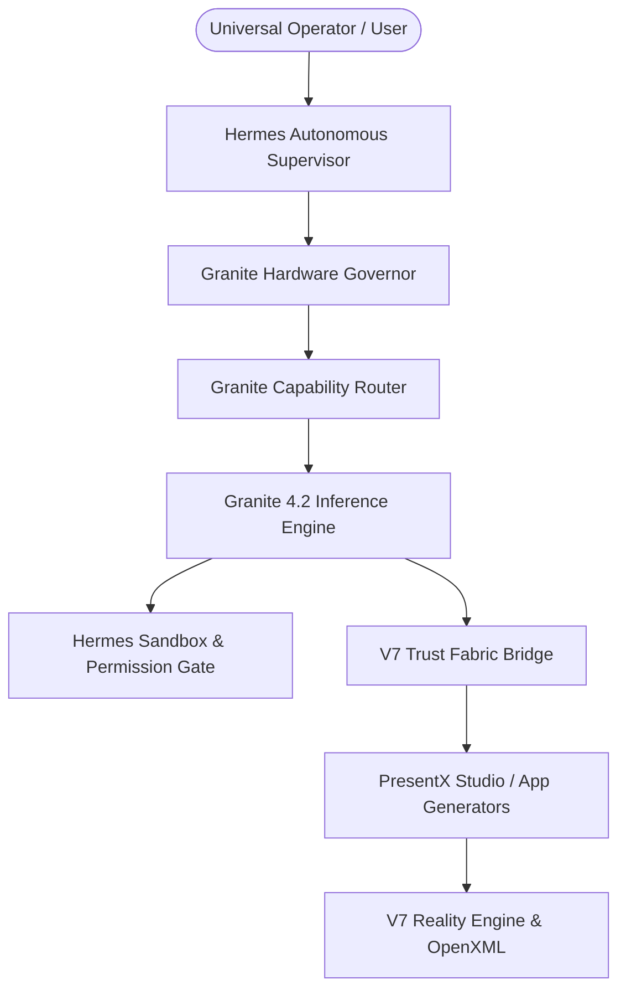

# Antigravity OS v7 — IBM Granite 4.2 Sovereign Model Fabric Architecture

**Release Version**: Antigravity OS v7.0  
**Component**: `src/plugins/granite/`  
**License**: Apache-2.0  
**Integration Pattern**: V7 PluginAdapterManager `MODEL_ADAPTER` (Zero Frozen-Core Mutation)

---

## 1. System Topology

IBM Granite 4.2 is integrated into Antigravity OS v7 as a first-class reasoning and tool-calling model provider operating strictly above the immutable V7 frozen core.

---

## 2. Core Architectural Principles

1. **Frozen Core Immutability**: No core files in `src/kernel`, `src/plugins/trust`, `src/plugins/hermes`, or `src/reality` are modified. Granite registers dynamically through `PluginAdapterManager`.
2. **Supervisor Authority**: Hermes remains the sole autonomous controller. Granite functions exclusively as a model intelligence engine.
3. **Zero Trust on Model Assertions**: Granite-generated statements receive `GENERATED` provenance tags. Self-confidence and LLM agreement are explicitly rejected as factual evidence.
4. **Hardware-Governed Execution**: CPU cores, RAM limits, and GPU VRAM thresholds dictate model sizing (3B vs. 8B vs. 30B MoE) and context boundaries.

---

## 3. Subsystem Reference

- `GraniteTypes.ts`: Comprehensive type schemas for Granite models, thinking modes, tool calls, and hardware profiles.
- `GraniteHardwareGovernor.ts`: Real hardware inspection via `systeminformation` / `os`.
- `GraniteModelRegistry.ts`: Catalog of Granite 3B, 8B, and 30B models with checksum verification and download gating.
- `GraniteEngine.ts`: Multi-mode inference runner (`FAST`, `THINKING`, `DEEP_REASONING`).
- `GraniteModelRouter.ts`: Capability-aware dynamic routing with three-tier fallback cascades.
- `GraniteHermesBridge.ts`: Supervised tool-calling integration.
- `GraniteTrustBridge.ts`: Claim registration and zero-trust quarantine filters.
- `GranitePresentXBridge.ts`: Narrative formulation, slide pacing, and repair planning.
- `GraniteBenchmarkEngine.ts`: 10-scenario multi-domain benchmark and A/B evaluation suite.
- `GranitePluginAdapter.ts`: `PluginAdapterManager` registration.
