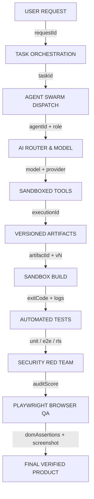

# 👁️ ANTIGRAVITY LEVEL-3 OBSERVABILITY & CORRELATION CHAIN SPECIFICATION

## 1. END-TO-END CORRELATION CHAIN

Every autonomous operation in Antigravity generates a cryptographically traceable and observable lineage chain across all 10 stages:

---

## 2. TRACE IDENTIFIER ENVELOPE

Every log entry, telemetry metric, SSE stream event, and artifact carries the complete correlation envelope:

| Identifier | Format | Scope | Example |
|---|---|---|---|
| `requestId` | `req_${timestamp}_${hash}` | Inbound HTTP / User Request | `req_1787373240_9ab3c` |
| `taskId` | `task_${slug}_${timestamp}` | Autonomous Software Factory Task | `task_saas-pm_1787371596585` |
| `workspaceId` | `ws_${tenant}_${slug}` | Multi-Tenant Workspace Boundary | `ws_tenant_alpha_enterprise` |
| `projectId` | `proj_${slug}` | Software Application Project | `proj_enterprise-crm` |
| `agentId` | `agent_${role}_${hash}` | Swarm Agent Worker | `agent_ARCHITECT_4001` |
| `executionId` | `exec_${tool}_${timestamp}` | Tool / Sandbox Execution Run | `exec_sandbox_write_1787373240` |
| `artifactId` | `art_${timestamp}_${hash}_v${version}` | Non-Destructive Versioned Artifact | `art_1787371596827_o3awp_v1` |

---

## 3. REAL-TIME EVENT STREAMING (SSE & KERNEL EVENTBUS)

Events emitted to the frontend dashboard on `http://localhost:3000` via SSE topic subscriptions:

1. `KERNEL_BOOTED` — Kernel core initialized
2. `TASK_STATE_CHANGED` — QUEUED → PLANNING → RUNNING → VALIDATING → COMPLETED
3. `ARTIFACT_PRODUCED` — Versioned artifact generated by specific agent
4. `DEFECT_DETECTED` — Self-healing classification (SYNTAX / TYPE / LOGIC)
5. `DEFECT_HEALED` — Patch applied & verified through re-build
6. `APPROVAL_REQUIRED` — PRODUCTION_CRITICAL action gate triggered
7. `APPROVAL_RESOLVED` — Human operator decision recorded
8. `BROWSER_QA_CAPTURED` — Playwright DOM assertion & screenshot taken
9. `QUOTA_EXHAUSTED` — Workspace / global budget limit hit
10. `CIRCUIT_STATE_CHANGED` — Provider circuit open / half-open / closed
