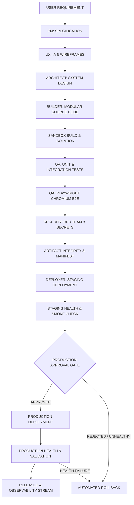

# 🏗️ ANTIGRAVITY LEVEL-4 PRODUCTION CONTROL ARCHITECTURE

## 1. COMPLETE SOFTWARE FACTORY PIPELINE

---

## 2. CORE SUBSYSTEM LAYERS

1. **Kernel & Supervision Layer (`src/kernel/`)**
   - Central `AntigravityKernel` supervising lifecycle, process health, and the `EventBus`.
2. **AI Routing & Budget Governor Layer (`src/server/ai/`)**
   - Priority mesh (`ollama` -> `deepseek` -> `openrouter`), circuit breakers (3 strikes, 30s cooldown), and per-workspace/global budget limits ($50 global, $10 workspace).
3. **Sandbox & Safety Isolation Layer (`src/server/sandbox/`)**
   - Directory sandboxing under `workspaces/`, blocking path traversal, command injection, and cross-workspace leakage.
4. **Policy Engine & Human Gate Layer (`src/server/policy/`)**
   - 4 risk levels (`READ_ONLY`, `LOW_RISK_WRITE`, `HIGH_RISK_WRITE`, `PRODUCTION_CRITICAL`). Mandatory approval required for `deploy:prod`.
5. **Deployment & Release State Layer (`src/server/deployment/`)**
   - 19-state deterministic release machine, provider abstraction (Vercel, Netlify, Local Staging), and bounded `RollbackOrchestrator`.
6. **Artifact Integrity Layer (`src/server/security/`)**
   - Non-destructive versioning (`v1` -> `v2`), SHA-256 manifest hashing, and `SecretRedactor` sanitization.
7. **Health & Observability Layer (`src/server/health/`, `src/server/alerts/`)**
   - Multi-subsystem composite health checks, structured alerts, and real-time SSE streaming to the dashboard.
