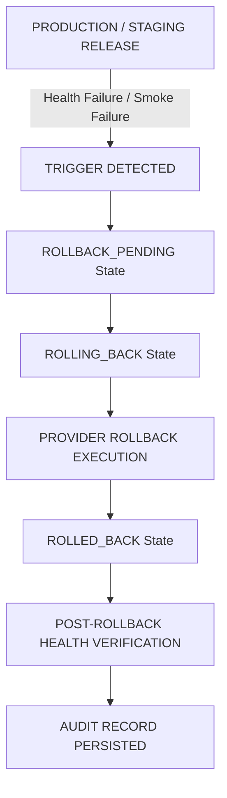

# 🔄 ANTIGRAVITY LEVEL-4 ROLLBACK ORCHESTRATION SPECIFICATION

## 1. ROLLBACK ARCHITECTURE & LIFECYCLE

Rollback is a first-class, automated, bounded, and audited lifecycle operation inside Antigravity:



---

## 2. ROLLBACK TRIGGERS

1. **`HEALTH_CHECK_FAILURE`**: Post-deployment `/api/health` returns non-200 or `DEGRADED`/`UNHEALTHY`.
2. **`SMOKE_TEST_FAILURE`**: Playwright browser E2E or HTTP integration smoke tests fail on primary user journeys.
3. **`5XX_ERROR_RATE_EXCEEDED`**: Server error rate threshold exceeded over rolling 60s window.
4. **`SECURITY_VIOLATION`**: Automated secret scanner detects credential leak post-deploy.
5. **`MANUAL_OPERATOR_ROLLBACK`**: Human operator triggers manual rollback via `/api/releases` or dashboard.

---

## 3. AUDIT RECORD FORMAT

Every rollback persists an immutable audit entry:
```json
{
  "releaseId": "rel_1787373956264_c1nbd",
  "targetRollbackReleaseId": "rel_previous_stable",
  "rollbackDeploymentId": "dep_rollback_1787373960",
  "restoredUrl": "http://localhost:3000",
  "durationMs": 0,
  "timestamp": "2026-08-22T04:46:00.000Z",
  "auditRecord": {
    "actor": "AUTOMATED_WATCHDOG",
    "reason": "HEALTH_CHECK_FAILURE",
    "previousState": "APPROVAL_PENDING",
    "newState": "ROLLED_BACK"
  }
}
```
