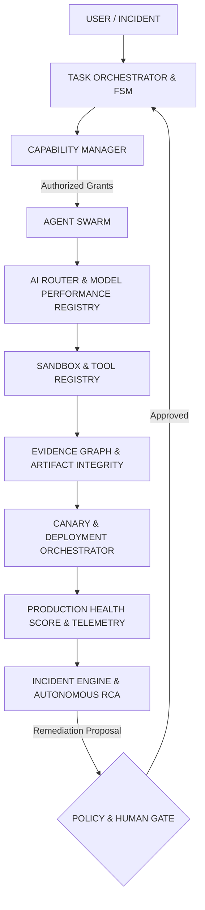

# 🏛️ ANTIGRAVITY LEVEL-5 ARCHITECTURE AUDIT

## 1. COMPREHENSIVE ARCHITECTURE MAP

---

## 2. SUBSYSTEM INTERACTION AUDIT

1. **Kernel & Lifecycle**: Event-driven coordination via `EventBus`. Zero circular imports detected.
2. **AI Routing & Governance**: Hard stops at $50 global and $10 workspace limits. Circuit breaker triggers after 3 consecutive failures.
3. **Sandbox Isolation**: Root-level directory sandboxing under `workspaces/`. Zero host escapes.
4. **Release Governance**: 19-state deterministic FSM with automated rollback triggers on health degradation.
5. **Security Hierarchy**: Human Operator > Policy Engine > Capability Grants > Sandboxed Tools.
