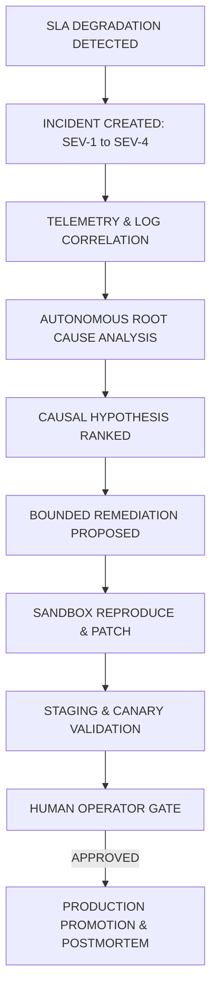

# 🚨 ANTIGRAVITY LEVEL-5 INCIDENT RESPONSE & AUTONOMOUS RCA

## 1. INCIDENT LIFECYCLE (SEV-1 TO SEV-4)

---

## 2. POSTMORTEM & PERMANENT LESSONS

Every resolved incident produces an immutable `postmortem.json` record with:
- Root cause diagnosis
- Contributing factors
- Timeline & detection latency
- Action items linked directly into the `EvidenceGraph`
