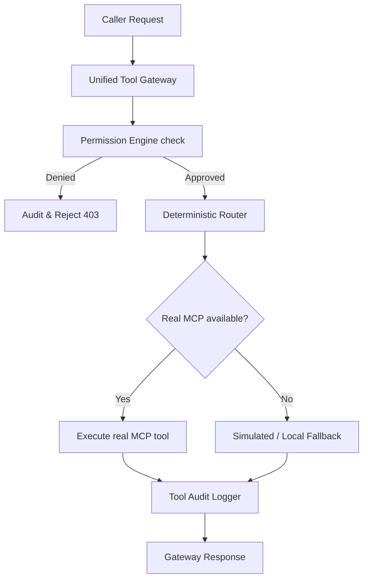

# OmniCraft Tool Routing Architecture

This document describes the architectural flow of tool execution inside the OmniCraft application workstation.

---

## 1. Gateway Orchestration Flow

Every tool call initiated by the workspace client or internal agents follows this unified pipeline:

---

## 2. Capability-Based Routing Policies

The Unified Tool Gateway resolves the target server using the following routing map:

1. **Context7**:
   * *Trigger*: Code search, documentation reference checks.
   * *Target*: `context7` MCP server.
2. **Fetch/Web Research**:
   * *Trigger*: Research queries, external URL fetches.
   * *Target*: `fetch-research` MCP server.
3. **Stitch / Figma**:
   * *Trigger*: UI layout generation, variant generation, figma token extraction.
   * *Target*: `StitchMCP` / `figma-mcp`.
4. **Playwright / Puppeteer**:
   * *Trigger*: Headless browser automation, E2E test runs, responsive audits.
   * *Target*: `playwright` / `puppeteer`.
5. **Chrome DevTools**:
   * *Trigger*: Browser inspecting, evaluating, console diagnostics.
   * *Target*: `chrome-devtools` MCP server.
6. **Sentry**:
   * *Trigger*: Logging server errors, tracking workspace failures.
   * *Target*: `sentry` MCP server.
7. **GitHub**:
   * *Trigger*: Repository commits, branch pushes, pull requests.
   * *Target*: `github` MCP server.
8. **Prisma**:
   * *Trigger*: Database schema inspections, status queries.
   * *Target*: `prisma-mcp-server`.
9. **Blender**:
   * *Trigger*: 3D model renderings, HDRI scene lighting tasks.
   * *Target*: `blender` MCP server.
10. **Memory Graph**:
    * *Trigger*: Semantic node creations, entity relation mappings.
    * *Target*: `memory` MCP server.
11. **Linear / Notion / n8n**:
    * *Trigger*: Issue creation, wiki pages sync, automation workflows.
    * *Target*: `linear` / `notion` / `n8n` MCP servers.

---

## 3. Fallback Mechanism

When a server requires authentication credentials that are unconfigured, or suffers execution timeouts, the gateway automatically falls back to **simulated/local responses** without crashing the main application thread. This ensures high availability and resilient production operations.
