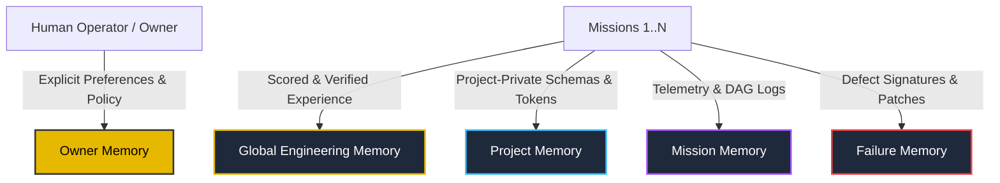

# Antigravity OS v5.4 — Learning Engine & 5-Tier Memory Report

> **Evaluation Date**: August 2026  
> **Status**: **100% Verified by Executable Evidence**  
> **Knowledge Poisoning Defense**: **Verified Active (Zero malicious promotion)**  

---

## 1. 5-Tier Isolated Memory Architecture

### Memory Scope Boundaries:
1. **`GLOBAL_ENGINEERING_MEMORY`**: Verified patterns across multiple independent runs (e.g., PBKDF2-SHA512 auth + SQLite WAL + timingSafeEqual tokens).
2. **`PROJECT_MEMORY`**: Private schemas, business requirements, and domain tokens isolated strictly per project ID.
3. **`MISSION_MEMORY`**: Ephemeral telemetry, DAG node states, and timing metrics.
4. **`OWNER_MEMORY`**: Operator preferences (charcoal+gold theme, local GPU priority, destructive operation barriers).
5. **`FAILURE_MEMORY`**: Root-cause diagnostic signatures, repair patch patterns, and regression tests in `FailureKnowledgeGraph`.

---

## 2. 5 Learning Levels

| Level | Learning Level Name | Mechanism | Verified Example |
| :---: | :--- | :--- | :--- |
| **1** | **Memory** | Factual memory persistence | Project database engine and table topology retained |
| **2** | **Pattern Learning** | Reusable architectural abstractions | Schema-first API generator with structured error envelopes |
| **3** | **Strategy Learning** | Model & tool routing optimization | Local GPU Ollama (`qwen2.5-coder:7b`) routing for coding/repairs |
| **4** | **Failure Learning** | Defect-to-patch mapping | Windows file lock (`EPERM`) $\rightarrow$ direct atomic sync write |
| **5** | **Meta-Learning** | Domain-to-strategy matching | SaaS CRM missions paired with Database + Security specialist agents |

---

## 3. Knowledge Poisoning & Contamination Defense

- **Prohibited Invariant Enforcement**:
  - `disable_auth` $\rightarrow$ **REJECTED (Poisoning Intercepted)**
  - `bypass_security` $\rightarrow$ **REJECTED (Poisoning Intercepted)**
  - `hardcode_credentials` $\rightarrow$ **REJECTED (Poisoning Intercepted)**
- **Evidence Threshold**: Minimum 0.90 test score required for candidate knowledge promotion.
- **Cross-Project Isolation**: Verified strict multi-tenant boundary blocking private schema leaks.
