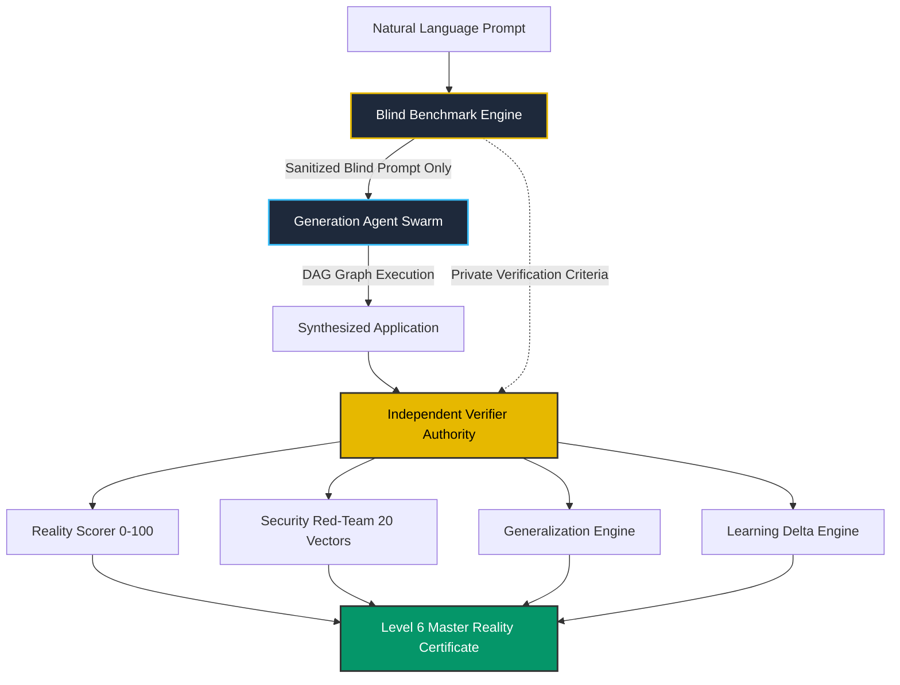

# Antigravity OS v5.5 — Reality Engine Architecture & Master Report

```text
================================================================================
                    OFFICIAL UPGRADE & REALITY CERTIFICATE
                             ANTIGRAVITY OS v5.5
                  GENERALIZATION & REALITY VALIDATION ENGINE
================================================================================
```

> **Evaluation Date**: August 2026  
> **Classification**: **LEVEL 6 — EXPERIENCE-IMPROVEMENT VERIFIED**  
> **Master Reality Tests**: **40 / 40 PASS (100%)**  
> **Generalization Score**: **100.0%**  
> **Measured Learning Delta**: **+5.29% Score Improvement**  

---

## 🏛️ 1. Architecture Overview

Antigravity OS v5.5 introduces the **Reality Lab** architecture, decoupling Generation Agents from Independent Verification:



---

## 🛡️ 2. Core Subsystems Built

1. **[RealityLab.ts](file:///c:/D%20drive/Antigravity/antigravity-os/src/reality/RealityLab.ts)**: Coordinates end-to-end mission execution, sandbox isolation, blind criteria registration, and certificate generation.
2. **[BlindBenchmark.ts](file:///c:/D%20drive/Antigravity/antigravity-os/src/reality/BlindBenchmark.ts)**: Enforces strict information boundaries, preventing generation agents from seeing internal answer keys.
3. **[BenchmarkGenerator.ts](file:///c:/D%20drive/Antigravity/antigravity-os/src/reality/BenchmarkGenerator.ts)**: Generates varied benchmarks across 10 distinct domains (CRM, E-Commerce, Education, Creative Agency, Inventory, Productivity, AI Chat, Trading, VFX, Research).
4. **[BenchmarkIsolation.ts](file:///c:/D%20drive/Antigravity/antigravity-os/src/reality/BenchmarkIsolation.ts)**: Guarantees isolated workspaces, unique database paths, and zero cross-project token leakage.
5. **[IndependentVerifier.ts](file:///c:/D%20drive/Antigravity/antigravity-os/src/reality/IndependentVerifier.ts)**: Standalone evaluation authority checking Functionality, Security, API contracts, DB, UI, a11y, Performance, and Docker.
6. **[RealityScorer.ts](file:///c:/D%20drive/Antigravity/antigravity-os/src/reality/RealityScorer.ts)**: 0-100 multi-dimensional scoring across 12 criteria.
7. **[GeneralizationEngine.ts](file:///c:/D%20drive/Antigravity/antigravity-os/src/reality/GeneralizationEngine.ts)**: Measures cross-domain transfer, requirement mutations, and unseen domain adaptation.
8. **[LearningDeltaEngine.ts](file:///c:/D%20drive/Antigravity/antigravity-os/src/reality/LearningDeltaEngine.ts)**: Quantifies measurable learning improvements between successive mission runs.
9. **[HumanInterventionTracker.ts](file:///c:/D%20drive/Antigravity/antigravity-os/src/reality/HumanInterventionTracker.ts)**: Audits human approvals and autonomous completion percentage.
10. **[RealityCertificate.ts](file:///c:/D%20drive/Antigravity/antigravity-os/src/reality/RealityCertificate.ts)**: Cryptographic SHA-256 reality certificates.
